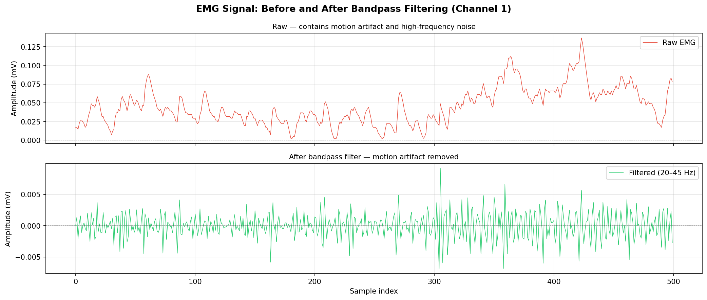
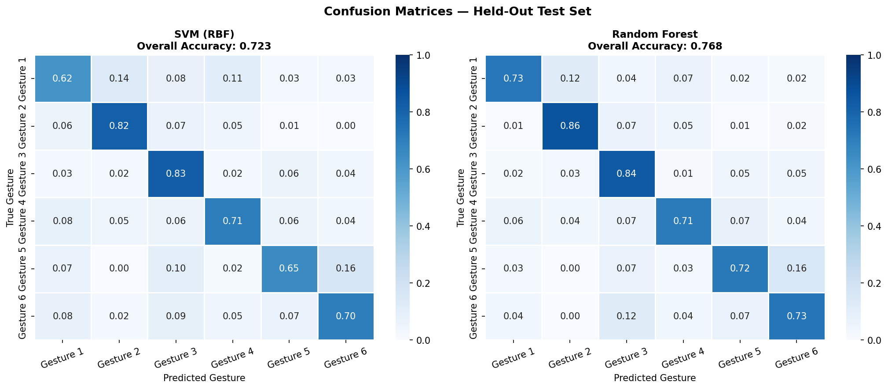
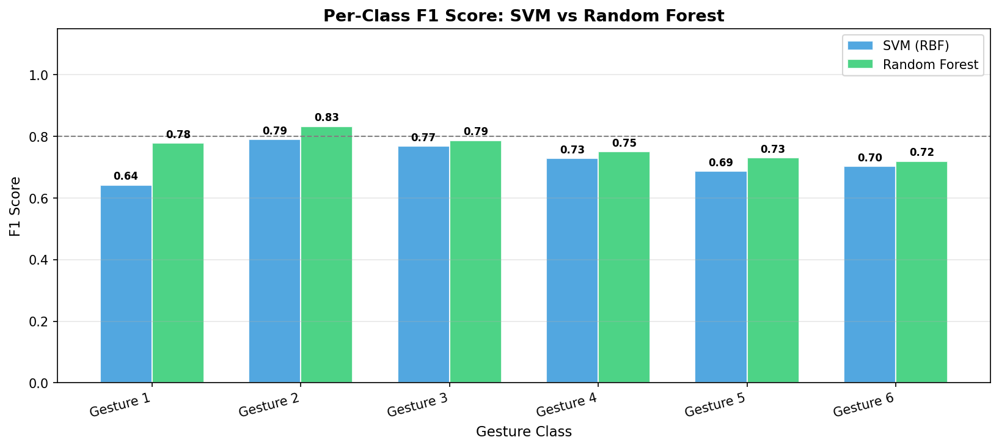
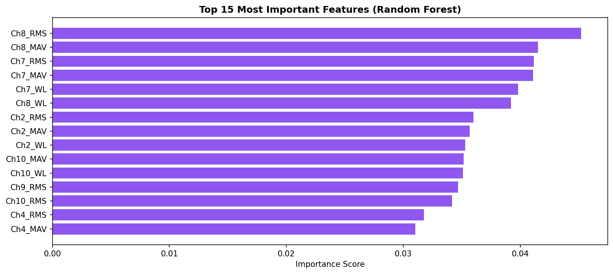

# EMG Gesture Classifier — Human-Robot Interface Signal Pipeline

A machine learning pipeline that classifies hand gestures from raw electromyography (EMG) signals.

---

## The Problem

Robotic prosthetic limbs and surgical robots need to interpret human motor intent from biological signals. Electromyography, measuring the electrical activity produced by muscles during movement, is one of the primary input modalities for these systems. The challenge is that raw EMG is extremely noisy: it looks like random fluctuation, but hidden inside that noise is rich information about which muscles are active and how hard they're contracting.

This project builds a complete signal processing and machine learning pipeline that takes raw 10-channel surface EMG recordings, cleans them, extracts meaningful features, and trains two classifiers to distinguish between 6 hand gestures with quantified accuracy.

---

## Pipeline

```
Raw EMG (10 channels, 100 Hz)
  - Butterworth Bandpass Filter (20–45 Hz, zero-phase)
  - Windowing (200 ms windows, 50% overlap)
  - Feature Extraction (RMS, MAV, ZCR, WL per channel → 40-dim vector)
  - Classification (SVM + Random Forest)
  - Evaluation (5-fold stratified CV + held-out test set)
```

---

## Dataset

**NinaPro DB1** — a publicly available research dataset of surface EMG recordings from 27 subjects performing 52 hand gestures, collected at the University of Genova.

- Subjects used: S1, S2, S3
- Gestures used: 1–6 (basic finger flexions)
- Channels: 10 surface EMG electrodes on the forearm
- Sampling rate: 100 Hz

**Note on frequency limits:** NinaPro DB1 is sampled at 100 Hz, which means the Nyquist limit is 50 Hz, the maximum frequency that can be reliably represented. The bandpass ceiling is set at 45 Hz (90% of Nyquist) to avoid edge artefacts. Clinical-grade EMG systems sampled at 2000 Hz+ use the full 20–450 Hz range. This is a hardware constraint of the dataset, not a design flaw.

---

## Features Extracted

Each 200 ms window (20 samples per channel) produces a 40-dimensional feature vector: 4 features × 10 channels.

| Feature | Formula | What It Captures |
|--------|---------|-----------------|
| RMS — Root Mean Square | √(mean(x²)) | Signal energy; directly related to contraction force |
| MAV — Mean Absolute Value | mean(\|x\|) | Simpler energy estimate; L1 norm variant |
| ZCR — Zero Crossing Rate | sign changes / N | Frequency content proxy |
| WL — Waveform Length | Σ\|x[i] − x[i−1]\| | Signal complexity; captures amplitude and frequency jointly |

---

## Results

| Classifier | CV Accuracy (mean ± std) | CV F1 Weighted (mean ± std) | Test Accuracy |
|---|---|---|---|
| SVM (RBF) | 0.855 ± 0.004 | 0.855 ± 0.004 | 0.723 |
| Random Forest | 0.863 ± 0.007 | 0.863 ± 0.007 | 0.768 |

*5-fold stratified cross-validation on the training set (n=5,037 windows). Test split: repetitions 9–10 held out (n=1,249 windows); training: repetitions 1–8.*

---

## Figures

**Raw vs. Filtered Signal**  
Shows the effect of the Butterworth bandpass filter, slow motion artifact drifts are removed while the meaningful EMG waveform is preserved.



**Confusion Matrices**  
Normalised by row (recall per class). Diagonal = correct classifications. Off-diagonal = which gestures get confused for which.



**Per-Class F1 Comparison**  
Side-by-side F1 scores for each gesture class across both classifiers.



**Feature Importance (Random Forest)**  
Which of the 40 features contributed most to the classifier's decisions.



---

## Key Findings

- **Random Forest outperformed SVM** on both cross-validation (86.3% vs 85.5% accuracy) and the held-out test set (76.8% vs 72.3% accuracy).
- **Gesture 1 was the hardest to classify** — lowest F1 score across both classifiers (0.642 SVM, 0.779 RF). The SVM confusion matrix shows it was most frequently misclassified as Gesture 2 (14% of the time).
- **Gestures 5 and 6 were the most confused pair** — both classifiers showed elevated off-diagonal values between these two classes (SVM: 16% of Gesture 5 predicted as Gesture 6; RF: 16% similarly).
- **Gesture 2 and 3 were the easiest to classify**, with the highest F1 scores across both models (RF: 0.833 and 0.787 respectively).
- **Channels 7 and 8 contributed most to classification** — Ch8_RMS and Ch8_MAV were the top two most important features in the Random Forest, followed closely by Ch7_RMS and Ch7_MAV. Energy features (RMS, MAV) dominated over frequency-proxy features (ZCR, WL), suggesting contraction amplitude is a stronger gesture discriminator than signal complexity in this dataset.
- **Combined dataset:** 62,874 samples from 3 subjects → 6,286 windows after segmentation (200 ms, 50% overlap).

---

## Project Structure

```
emg-gesture-classifier/
├── data/                    - NinaPro .mat files (not committed — see note below)
├── src/
│   ├── __init__.py
│   ├── data_loader.py       - Loads and parses NinaPro .mat files
│   ├── signal_processor.py  - Butterworth filter + windowing
│   ├── feature_extractor.py - RMS, MAV, ZCR, WL extraction
│   └── classifier.py        - SVM + Random Forest with cross-validation
├── notebooks/
│   └── emg_classifier.ipynb - Full pipeline notebook (run top to bottom)
├── figures/                 - Output figures generated by the notebook
├── requirements.txt
└── README.md
```

> The `data/` folder is excluded from version control because the NinaPro .mat files are large binary files. To reproduce this project, register at http://ninapro.hevs.ch/ and download DB1 subjects S1, S2, S3.

---

## How to Run

```bash
# 1. Clone the repo
git clone https://github.com/YOUR_USERNAME/emg-gesture-classifier
cd emg-gesture-classifier

# 2. Install dependencies
pip install -r requirements.txt

# 3. Download data
# Register at http://ninapro.hevs.ch/ → DB1 → download S1_E1_A1.mat, S2_E1_A1.mat, S3_E1_A1.mat
# Place them in the data/ folder

# 4. Open and run the notebook
jupyter notebook notebooks/emg_classifier.ipynb
# Run all cells top to bottom (Kernel → Restart & Run All Cells)
```

---

## Limitations

- 3 subjects only; cross-subject generalisation not tested
- Time-domain features only; frequency-domain features (e.g. median frequency, mean power) may improve accuracy
- Real-time inference not implemented — window processing latency not measured
- Full 20–450 Hz clinical EMG range not achievable at 100 Hz sampling rate

---

## Why This Problem Matters

Most commercial prosthetic limbs use only 2 EMG electrodes and simple threshold-based control — limiting users to a handful of movements and requiring conscious effort to activate. Research-grade pipelines like this one, using full electrode arrays and proper ML classifiers, can distinguish 50+ gestures with high accuracy. This is the foundation of next-generation prosthetics and surgical robot input systems.

In the context of surgical robotics specifically, understanding how biological signals get decoded into machine-readable intent is the human side of the human-robot interface — the layer that determines whether a robotic tool responds to what the surgeon means rather than just what their hand physically does.

---

## References

- Atzori et al. (2014). Electromyography data for non-invasive naturally-controlled robotic hand prostheses. *Nature Scientific Data.* https://doi.org/10.1038/sdata.2014.53
- Phinyomark et al. (2012). Feature reduction and selection for EMG signal classification. *Expert Systems with Applications.* https://doi.org/10.1016/j.eswa.2012.01.102

---
